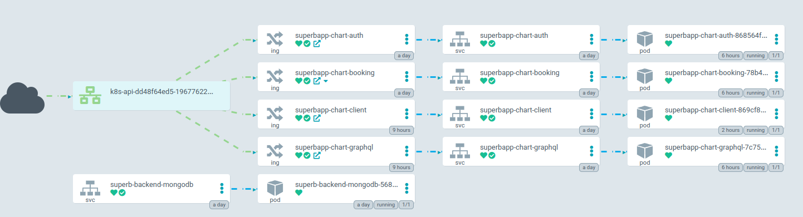

# Superb Site Reliability Engineering Challenge

A fun and practical test for the SRE position at Superb.

## Introduction

Superb is growing. Today we have 4 applications organized in a [monorepo](https://en.wikipedia.org/wiki/Monorepo). They are:

- **[auth](./auth/)**: An HTTP API used to register and authenticate users that will use our platform. This is a high audience service and must have attention with it.
- **[booking](./booking/)**: A gRPC API responsible by manage restaurant bookings.
- **[graphql](./graphql/)**: This API is our border service. It make the bridge between frontend applications and our microservices.
- **[client](./client/)**: This API is a frontend app used to manage bookings.

## Infrastructure design

The infrastructure is mainly deployed in AWS, with some GitHub resources and Dockerhub repositories.

### Pulumi

All the AWS resources in this project is provisioned and declaratively implemented in the `infra` directory using [Pulumi](https://pulumi.com). Pulumi is an infrastructure as code (IaC) tool that uses an SDK based approach to infrastructure.

For this application the Pulumi code was kept as simple as possible to demonstrate idea of the design, thus it does not contain a complex file structure as would be advised by [Pulumi best practice](https://www.pulumi.com/docs/guides/)

The resource graph for all the resources created and managed by Pulumi can be viewer [here](frontend.wernichbekker.com/resource_graph/pulumi-final.html).

### Infrastructure overview

Below is a broad overview of the services used to host this project:

The frontend is hosted in CloudFront and S3. This allows for easy serving of the static content and edge caching using the CDN, making the frontend appear much faster for end users.

The backend is hosted in EKS on scaling nodegroups. The apis are exposed using the ALB ingress controller.

### MongoDB

For this demo project, the choice was made to host MongoDB in kubernetes alongside the application. This was done to save some cost on the AWS bill, and allow easy local development. In a production ready environment, I would suggest using a hosted MongoDB compatible service. In this case I would suggest either DynamoDB or DocumentDB due to not incurring any egress costs outside of the AWS VPC.

## Application

### Kubernetes

[Kubernetes](https://kubernetes.io) is an open-source container orchestration system. For this project, [Helm](https://helm.sh) was used to package and template the kubernetes manifests. The templated manifests can be found [here](/kubernetes/helm/templated-files)  

Below a simplified view of the deployed app can be viewed. For this application the client was also deployed in kubernetes to showcase the that the same helm chart could be used for full local development.

### ArgoCD

[ArgoCD](https://argo-cd.readthedocs.io/en/stable/) is a declarative, continuous delivery, [GitOps](https://about.gitlab.com/topics/gitops/) tool that has been adopted into the [CNCF](https://www.cncf.io/). For this project I used ArgoCD to declaratively manage the deployments to Kubernetes.

The superbapp helm chart is templated and deployed by ArgoCD. As GitOps principles dictate, argo watched the repo for updates to the [values file](/kubernetes/helm/superbapp/values-application.yaml). Each time an update is made to the helm chart or values file, ArgoCD attempts to sync the declared state to the observed state in Kubernetes. ArgoCD allows for auto and manual rollbacks in the event of failure.

## Endpoints
The relevant endpoints are listed below:
- client: Cloudfront: [frontend.wernichbekker.com](https://frontend.wernichbekker.com) kubernetes:[client.wernichbekker.com](https://client.wernichbekker.com)
- graphql: [graphql.wernichbekker.com](https://graphql.wernichbekker.com)
- booking: [api.wernichbekker.com/booking](https://api.wernichbekker.com/booking)
- argo: [argo.wernichbekker.com/booking](https://argo.wernichbekker.com)

# Improvements
As with any software project, there are always many, many improvements that could be made. Below are some of the suggestions.

### MongoDB
As discussed above, for the system to be production ready, it is recommended to use a hosted service for the database.

### Pulumi
Many improvements could be made to the project structure to designed components to be more generic and reusable.

### Secrets
Use a secret manager like AWS secrets manager, AWS parameter store, Hashicorp vault etc. to store secrets. For components that could use IAM authentication, the latter is preferred eg. DynamoDB, RDS.

### Observability
The app currently has no observability platform. For a production application observability is **key** to maintaining a stable service. My suggestions would be Prometheus, Loki, Grafana with any of the open telemetry protocols (Jaeger, Zipkin, OpenTelemetry). This would also make ArgoCD more useful as decisions regarding an app's health could be made with more information.

### ArgoCD
Currently, the ArgoCD setup is only using the rolling release strategy. This is sufficient for many productions systems, though a more sophisticated blue/green or canary deployment pipeline could be designed.

### Frontend CI/CD
The frontend CI/CD does not support more than the production environment. A simple yet effective solution would be to use generative subdomains to deploy n amount of frontends and prune them when they are not necessary anymore.

### Kubernetes
Currently, none of the resources in kubernetes support auto-scaling. The deployments should use HorizontalPodAutoscalers to meet variagle demand. This should be pared with a cluster autoscaler using either native aws nodegroups or a project like the emerging [karpenter](https://karpenter.sh/).

